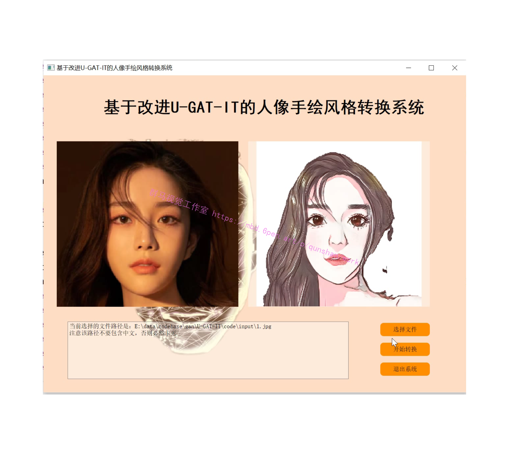
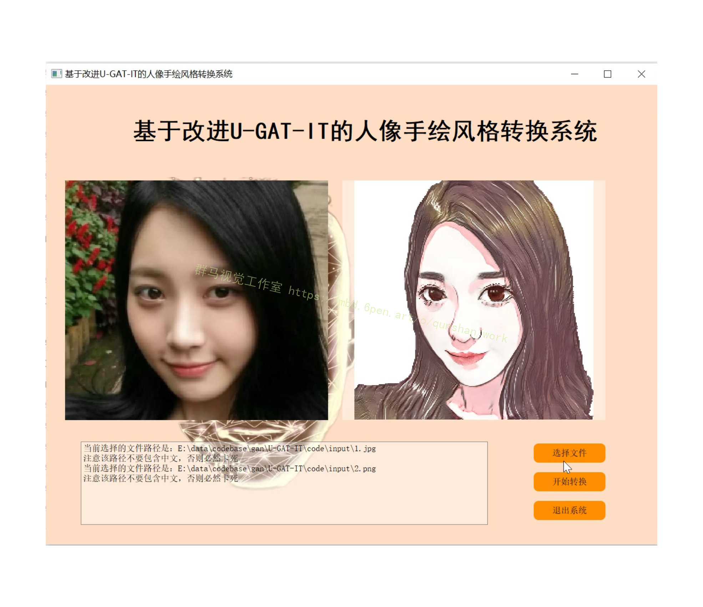
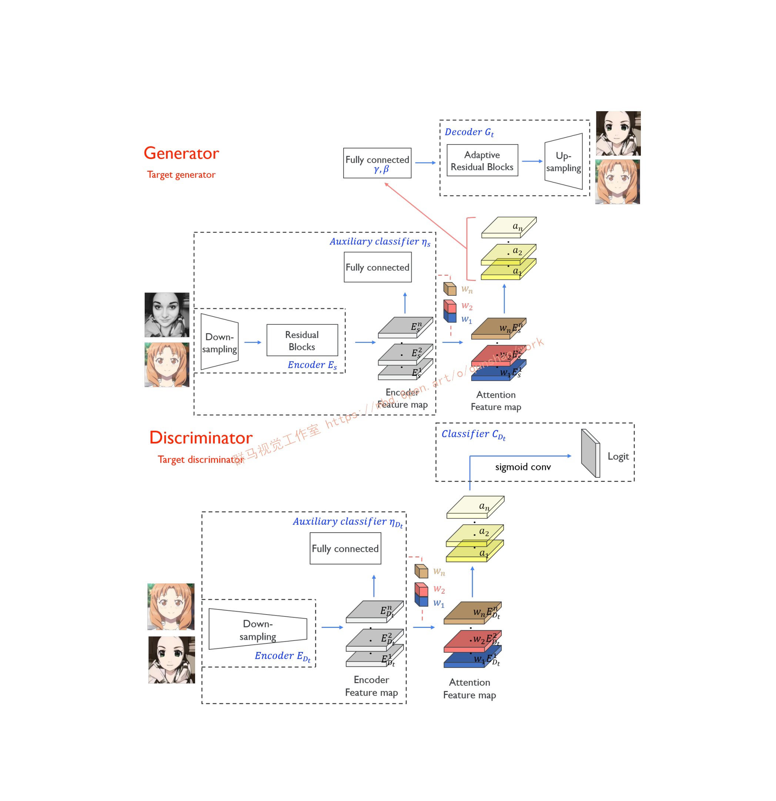
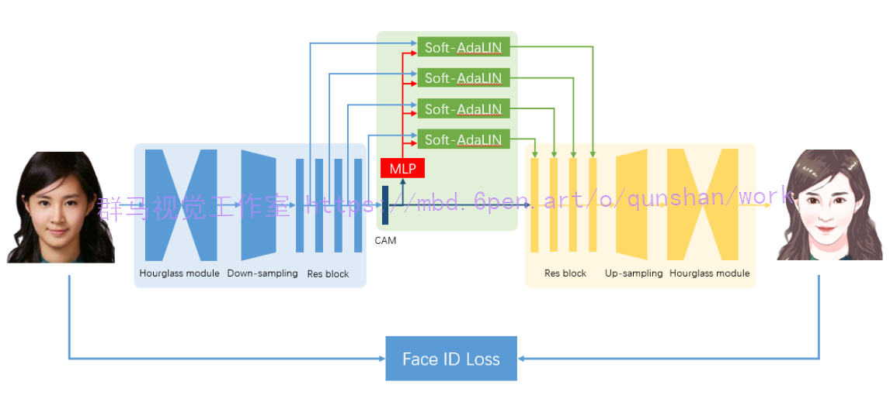
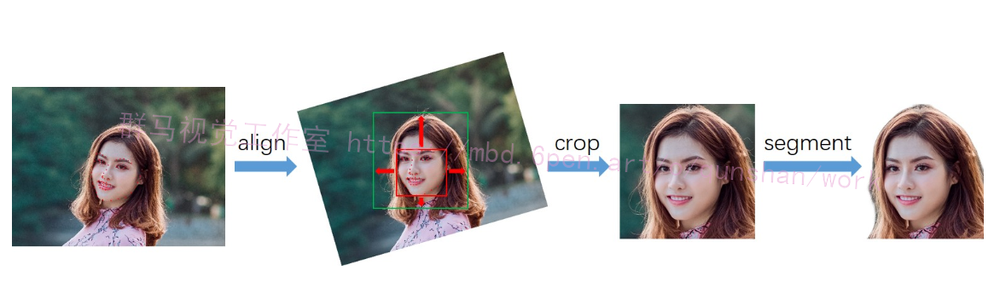
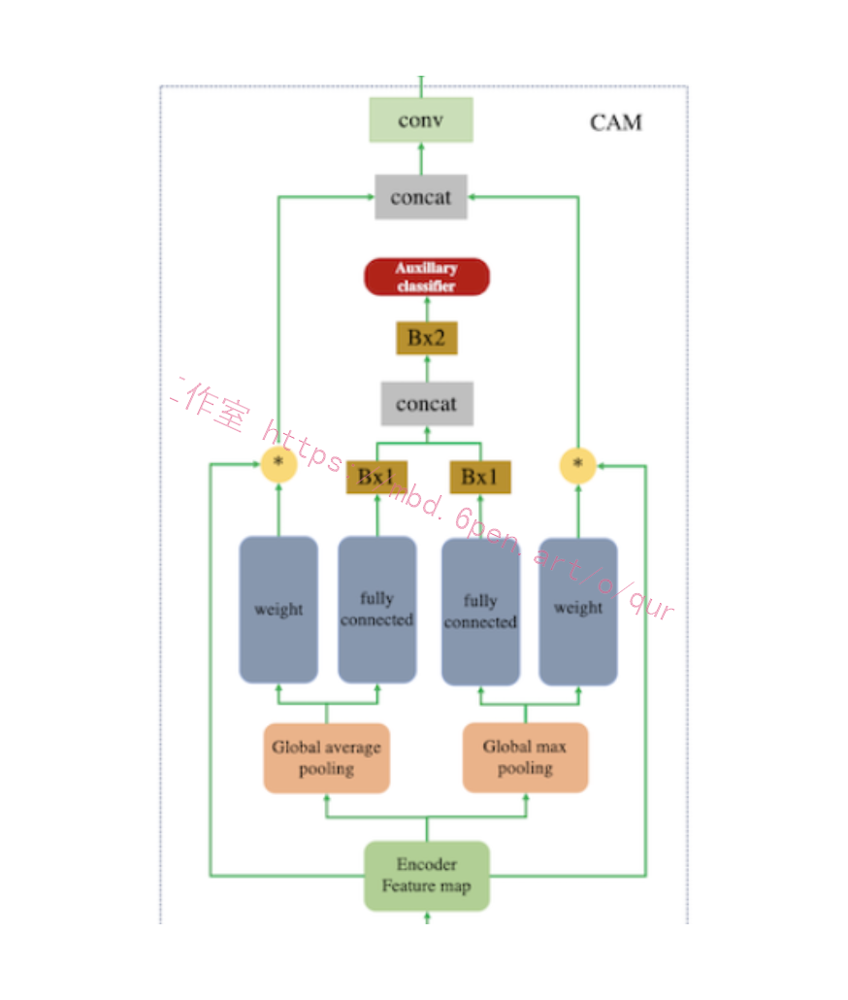
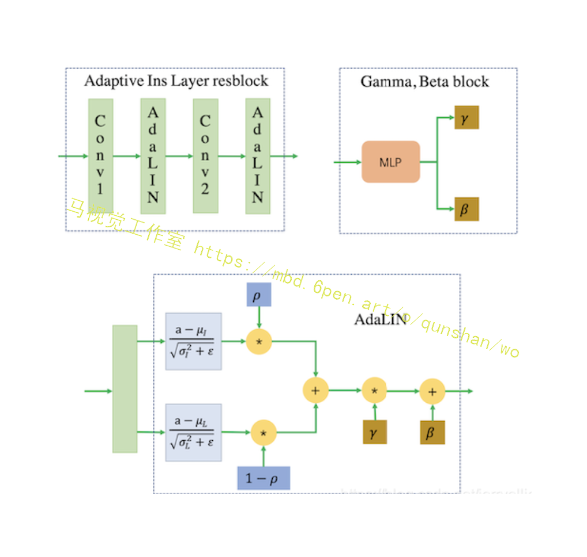

# 1.研究背景
人像手绘风格渲染的目标是，在保持原图像ID信息和纹理细节的同时，将真实照片转换为手绘风格的非真实感图像。一般而言，基于成对数据的pix2pix方法能达到较好的图像转换效果，但本任务的输入输出轮廓并非一一对应，例如卡通风格的眼睛更大、下巴更瘦；且成对的数据绘制难度大、成本较高，因此我们采用unpaired image translation方法来实现。

# 2.图片演示




# 3.视频演示
[基于改进U-GAT-IT的人像手绘风格转换系统（源码＆教程）_哔哩哔哩_bilibili](https://www.bilibili.com/video/BV1WK411Z7j4/?spm_id_from=333.999.0.0&vd_source=bc9aec86d164b67a7004b996143742dc)


# 4.U-GAT-IT算法简介
图像到图像转换可以应用在很多计算机视觉任务，图像分割、图像修复、图像着色、图像超分辨率、图像风格（场景）变换等都是图像到图像转换的范畴。生成对抗网络 [1] 不仅仅在模型训练的收敛速度上，同时在图像转换质量上展示了优越的结果。

这些优越性能相比 Pixel CNN、VAE、Glow 都是具有很大竞争力的。所以近年来的围绕 GAN 实现图像翻译的研究是很多的，例如 CycleGAN、UNIT、MUNIT、DRIT、FUNIT、SPADE。图像翻译是 GAN 铺开应用的第一步，跨模态间的转换，文本到图像、文本到视频、语音到视频等，凡是这种端到端，希望实现一个分布到另一个分布转换的过程，GAN 都是可以发挥一定的作用的。

回归到现实，图像到图像的转换到目前为止还是具有一定挑战性的，大多数的工作都围绕着局部纹理间的转换展开的，例如人脸属性变换、画作的风格变换、图像分割等，但是在图像差异性较大的情况下，在猫到狗或者是仅仅是语义联系的图像转换上的表现则不佳的。

这就是图像转换模型的适用域问题了，实现一个具有多任务下鲁棒的图像转换模型是十分有必要的。本文将要介绍的 U-GAT-IT 正是为了实现这种鲁棒性能设计的，我们先宏观的看一下文章采用何种方式去实现这种鲁棒性能。

首先是引入注意力机制，这里的注意力机制并不传统的 Attention 或者 Self-Attention 的计算全图的权重作为关注，而是采用全局和平均池化下的类激活图（Class Activation Map-CAM）[2] 来实现的，CAM 对于做分类和检测的应该很熟悉，通过 CNN 确定分类依据的位置，这个思想和注意力是一致的，同时这对于无监督下语义信息的一致性判断也是有作用的，这块我们后续再进行展开。

有了这个注意力图，文章再加上自适应图层实例归一化（AdaLIN），其作用是帮助注意力引导模型灵活控制形状和纹理的变化量。有了上述的两项作用，使得 U-GAT-IT 实现了鲁棒下的图像转换。总结一下 U-GAT-IT 的优势：

（1）提出了一种新的无监督图像到图像转换方法，它具有新的注意模块和新的归一化函数 AdaLIN。
（2）注意模块通过基于辅助分类器获得的注意力图区分源域和目标域，帮助模型知道在何处进行密集转换。
（3）AdaLIN功能帮助注意力引导模型灵活地控制形状和纹理的变化量，增强模型鲁棒性。




# 5.U-GAT-IT算法改进
[参考该博客的方案提出了一种归一化方法——AdaLIN](https://mbd.pub/o/bread/Y5yUl5hq)，能够自动调节Instance Norm和Layer Norm的比重，再结合attention机制能够实现精美的人像日漫风格转换。为了实现写实的人像卡通化风格，我们对U-GAT-IT进行了定制化的修改。

我们提出了一种Soft-AdaLIN（Soft Adaptive Layer-Instance Normalization）归一化方法，在反规范化时将编码器的均值方差（照片特征）与解码器的均值方差（卡通特征）相融合。

模型结构方面，在U-GAT-IT的基础上，我们在编码器之前和解码器之后各增加了2个hourglass模块，渐进地提升模型特征抽象和重建能力。

我们还增加了Face ID Loss，使用预训练的人脸识别模型提取照片和卡通画的ID特征，通过余弦距离来约束生成的卡通画，使其更像本人。



由于实验数据较为匮乏，为了降低训练难度，我们将数据处理成固定的模式。首先检测图像中的人脸及关键点，根据人脸关键点旋转校正图像，并按统一标准裁剪，再将裁剪后的头像输入人像分割模型去除背景。


#### 引入注意力机制
这里的注意力机制采用全局和平均池化下的类激活图(CAM, Class Activation Map)来实现的,CAM如图所示


#### 代码实现
```
'''
输入是（B，N，D），B是batch size，N是节点数，D是每个节点的原始特征维数
输出是（B，N，F），F是每个节点的新特征维数
每个节点从维度D到维度F是按注意力为权重聚合了邻居节点的特征
'''

def att_head(seq, out_sz, bias_mat, activation, in_drop = 0.0, coef_drop = 0.0, residual = False):
    '''
    seq：输入（B，N，D），B是batch size，N是节点数，D是每个节点的原始特征维数
    out_sz：每个节点的输出特征维数，设为F
    bias_mat：（N，N）掩码矩阵
    activation：激活函数
    in_drop：输入的dropout率
    coef_drop：注意力矩阵的dropout率
    residual：是否使用残差网络
    '''
    
    with tf.name_scope('my_attn'):
        # drop out 防止过拟合;如果为0则不设置该层
        if in_drop != 0.0:
            seq = tf.nn.dropout(seq, 1.0 - in_drop)
        
        '''
        为了获得足够的表达能力以将输入特征转化为高级特征，需要至少一种可学习的线性变换。为此，作为第一步，
        我们学习一个W矩阵用于投影特征
        实现公式seq_fts = Wh，即每个节点的维度变换
        '''
        
        # F2F'
        seq_fts = tf.keras.layers.Conv1D(seq, out_sz, 1, use_bias=False)

        '''
        实现公式 f_1 = a(Whi); f_2 = a(Whj)
        f_1+f_2的转置实现了logits = eij = a(Whi) + a(Whj)
        eij经过激活,softmax得到论文中的aij,即点i对点j的注意力
        bias_mat是为了让非互为邻居的注意力不要j进入softmax的计算
        只有互为邻居的注意力才能进入softmax,从而保证了注意力在局部
        '''
        
        # (B, N, F) => (B, N, 1)
        f_1 = tf.keras.layers.Conv1D(seq_fts, 1, 1)
        # (B, N, F) => (B, N, 1)
        f_2 = tf.keras.layers.Conv1D (seq_fts, 1, 1)
        
        # (B, N, 1) + (B, N, 1) = (B, N, N)
        # logits 即 eij
        logits = f_1 + tf.transpose(f_2, [0, 2, 1])
        # (B, N, N) + (1, N, N) => (B, N, N) => softmax => (B, N, N)
        # 这里运用了 tensorflow 的广播机制
        # 得到的logits 并不是一个对角矩阵, 这是因为 f_1 和 f_2并非同一个参数 a
        # logits{i,j} 等于 a1(Whi) + a2(Whj)
        
        # 注意力系数矩阵coefs=(aij)_{N*N}
        # bias_mat 体现 mask 思想, 保留了图的结构信息, 

        
        coefs = tf.nn.softmax(tf.nn.leaky_relu(logits) + bias_mat)
        
        # 输入矩阵、注意力系数矩阵的dropout操作
        if coef_drop != 0.0:
            coefs = tf.nn.dropout(coefs, 1.0 - coef_drop)
        if in_drop != 0.0:
            seq_fts = tf.nn.dropout(seq_fts, 1.0 - in_drop)
            
        '''
        实现 hi = sum(aijWhj)
        即节点i根据注意力聚合邻居特征
        '''
        
        # (B, N, N) * (B, N, F) => (B, N, F)
        vals = tf.matmul(coefs, seq_fts)
        
        
        
        # 添加偏置项
        ret = tf.contrib.layers.bias_add(vals)
        
        '''
        添加残差连接后,激活
        如果输入(B, N, D)和聚合了节点特征的输出(B, N, F)的最后一个维度相同,则直接相加
        否则将(B, N, D)线性变换为(B, N, F) 再相加
        '''
        
        # residual connection
        if residual:
            # D != F
            if seq.shape[-1] != ret.shape[-1]:
                ret = ret + conv1d(seq, ret.shape[-1], 1) # activation
            else:
                ret = ret + seq
        
        return activation(ret) # activation

```
#### 自适应图层实例归一化(AdaLIN, Adaptive Layer Instance Normalization)
自适应图层实例归一化的参数是在训练期间通过在实例归一化（IN）和图层归一化（LN）之间选择合适的比率从[该博客](https://afdian.net/item?plan_id=17e9aa50657d11edba3752540025c377)中学习的,其作用是帮助注意力机制引导模型灵活控制形状和纹理的变化量.
整个模型框架中包含两个生成器和两个判别器,在生成器和判别器部分均加入了attention模块.模型基于辅助分类器获得注意力图,通过区分源域和目标域,指导转换专注于更重要的区域,而忽略次要区域.这些注意力图在生成器和判别器中都有嵌入来专注于重要的语义区域,促进形状变换.生成器中的注意力图引起对专门区分这两个域的区域的关注,而鉴别器中的注意力图则通过关注目标域中真实图像和伪图像之间的差异来帮助进行微调.因此,无需修改模型架构或超参数，就可以完成变化较大的image translation任务.下面具体介绍生成器和判别器.



#### 代码实现
```
class BaseGAttN:
    def loss(logits, labels, nb_classes, class_weights):
        sample_wts = tf.reduce_sum(tf.multiply(tf.one_hot(labels, nb_classes), class_weights), axis=-1)
        xentropy = tf.multiply(tf.nn.sparse_softmax_cross_entropy_with_logits(
                labels=labels, logits=logits), sample_wts)
        return tf.reduce_mean(xentropy, name='xentropy_mean')
    
    def training(loss, lr, l2_coef):
        # weight decay
        vars = tf.trainable_variables()
        lossL2 = tf.add_n([tf.nn.l2_loss(v) for v in vars if v.name not in ['bias', 'gamma', 'b', 'g', 'beta']] * l2_coef)
        
        # optimizer 
        opt = tf.train.AdamOptimizer(learning_rate = lr)
        
        # training op
        train_op = opt.minimize(loss + lossL2)
        
        return train_op
    
    
    def masked_softmax_cross_entropy(logits, labels, mask):
        '''
        Softmax cross-entropy loss with masking.
        logits: 模型的输出,维度(B, C); B是样本量, C是输出维度
        labels: 模型的标签,维度(B, C)
        mask: 掩码,维度(B, )
        '''
        
        # logits 先用softmax转化为概率分布,再和labelsj计算交叉熵
        # loss 维度是(B,)
        loss = tf.nn.softmax_cross_entropy_with_logits(logits = logits, labels = labels)
        
        # 将数据类型转化为 tf.float32
        mask = tf.cast(mask, dtype = tf.float32)
        
        # 将mask值归一化
        mask /= tf.reduce_mean(mask)
        
        # 屏蔽掉某些样本的损失
        loss *= mask
        
        # 返回均值损失
        return tf.reduce_mean(loss)
    
    
    def masked_sigmoid_cross_entropy(logits, labels, mask):
        '''
        Softmax cross-entropy loss with masking.
        logits:(B, C), 模型输出; B是样本量,C是输出维度
        labels:(B, C), 真实标签
        mask: 掩码,维度(B,)
        '''
        labels = tf.cast(mask, dtype = tf.float32)
        # loss 维度是(B,)
        loss = tf.nn.sigmoid_cross_entropy_with_logits(logits = logits, labels = labels)
        # (B,C) =>(B,)
        loss = tf.reduce_mean(loss, axis = 1)
        
        mask /= tf.reduce_mean(mask)
        loss *= mask
        
        return tf.reduce_mean(loss)
    
    def masked_accuracy(logits, labels, mask):
        '''
        Accuracy with masking
        logits:(B, C), 模型输出; B是样本量, C是输出维度
        labels:(B, C), 真实标签
        mask: 掩码,维度(B,)
        '''
        
        # 计算预测值和真实值的索引相同,则预测正确
        correct_prediction = tf.equal( tf.argmax(logits, 1), tf.argmax(labels, 1) )
        accuracy_all = tf.cast( correct_prediction, tf.float32 )
        mask = tf.cast( mask, dtype = tf.float32 )
        mask /= tf.reduce_mean(mask)
        accuracy_all *= mask
        return tf.reduce_mean(accuracy_all)
    
    
#%%
class GAT(BaseGAttN):
    
    def inference(inputs, nb_classes, nb_nodes, training, attn_drop, ffd_drop, bias_mat,
                  hid_mat, hid_units, n_heads, activation = tf.nn.elu, residual = False):
        '''
        inputs:(B,N,D), B是batch size, N是节点数, D是每个节点的原始特征维数
        nb_classes: 分类任务的类别数, 设为C
        nb_nodes: 节点个数,设为N
        training: 标志'训练阶段', '测试阶段'
        attn_drop: 注意力矩阵dropout率,防止过拟合
        ffd_drop: 输入的dropout率,防止过拟合
        bias_mat: 一个(N, N)矩阵,由邻接矩阵A变化而来,是注意力矩阵的掩码
        hid_units: 列表, 第i个元素是第i层的每个注意力头的隐藏单元数
        n_heads: 列表, 第i个元素是第i层的注意力头数
        activation: 激活函数
        resudial: 是否采用残差连接
        '''
        
        
        '''
        第一层,由H1个注意力头,每个头的输入都是(B, N, D), 每个头的注意力输出都是(B, N, F1)
        将所有注意力头的输出聚合, 聚合为(B, N, F1*H1)
        '''
        attns = []
        # n_heads[0] = 第一层注意力头数, 设为 H1
        for i in range(n_heads[0]):
            attns.append(
                    attn_head(inputs, bias_mat = bias_mat, 
                              out_sz = hid_units[0], activation = activatoin,
                              in_drop = ffd_drop, coef_drop = attn_drop, residual = False)
                    ) 
                    
        # [(B, N, F1), (B, N, F1)..] => (B, N, F1 * H1)
        
        h_1 = tf.concat(attns, axis = -1) # 连接上一层
        
        '''
        中间层,层数是 len(hid_units)-1;
        第i层有Hi个注意力头,输入是(B, N, F1*H1),每头注意力输出是(B, N, F1);
        每层均聚合所有头的注意力, 得到(B, N, Fi * Hi)
        '''
        # len(hid_units) = 中间层的个数
        for i in range(1, len(hid_units)):
            h_old = h_1 # 未使用
            attns = []
            # n_heads[i] = 中间第i层的注意力头数,设为Hi
            for _ in range(n_heads[i]):
                attns.append(
                        attn_head(h_1, bias_mat = bias_mat,
                                  out_sz = hid_units[i], activation = activation,
                                  in_drop = ffd_drop, coef_drop = attn_drop, residual = residual)
                        )
            
            # [(B, N, Fi), (B, N, Fi) ..] => (B, N, Fi*Hi)
            h_1 = tf.concat(attns, axis = -1) # 连接上一层
        
        '''
        最后一层,共有n_heads[-1]个注意力,一般为1
        输入: 最后一层的输出为(B, N, Fi*Hi)
        输出: (B, N, C), C是分类任务数
        输出:
        '''
        
        
        out = []
        for i in range(n_heads[-1]):
            out.append(
                    attn_head(h_1, bias_mat = bias_mat, 
                              out_sz = nb_classes, activation = lambda x : x,
                              in_  drop = ffd_drop, coef_drop = attn_drop, residual = False   )
                    )
        
        # 将多头注意力相加取平均
        logits = tf.add_n(out) / n_heads[-1]
        
        return logits
    


```

# 6.系统整合

下图[完整源码＆环境部署视频教程＆自定义UI界面](https://s.xiaocichang.com/s/d0a6e0)


参考博客[《基于改进U-GAT-IT的人像手绘风格转换系统（源码＆教程）》](https://mbd.pub/o/qunma/work)

# 7.参考文献
***
[1][王晋宇](https://s.wanfangdata.com.cn/paper?q=%E4%BD%9C%E8%80%85:%22%E7%8E%8B%E6%99%8B%E5%AE%87%22),[杨海涛](https://s.wanfangdata.com.cn/paper?q=%E4%BD%9C%E8%80%85:%22%E6%9D%A8%E6%B5%B7%E6%B6%9B%22),[李高源](https://s.wanfangdata.com.cn/paper?q=%E4%BD%9C%E8%80%85:%22%E6%9D%8E%E9%AB%98%E6%BA%90%22),等.[生成对抗网络及其图像处理应用研究进展](https://d.wanfangdata.com.cn/periodical/jsjgcyyy202108004)[J].[计算机工程与应用](https://sns.wanfangdata.com.cn/perio/jsjgcyyy).2021,(8).DOI:[10.3778/j.issn.1002-8331.2011-0322](http://dx.chinadoi.cn/10.3778/j.issn.1002-8331.2011-0322).

[2][张恩琪](https://s.wanfangdata.com.cn/paper?q=%E4%BD%9C%E8%80%85:%22%E5%BC%A0%E6%81%A9%E7%90%AA%22),[顾广华](https://s.wanfangdata.com.cn/paper?q=%E4%BD%9C%E8%80%85:%22%E9%A1%BE%E5%B9%BF%E5%8D%8E%22),[赵晨](https://s.wanfangdata.com.cn/paper?q=%E4%BD%9C%E8%80%85:%22%E8%B5%B5%E6%99%A8%22),等.[生成对抗网络GAN的研究进展](https://d.wanfangdata.com.cn/periodical/jsjyyyj202104002)[J].[计算机应用研究](https://sns.wanfangdata.com.cn/perio/jsjyyyj).2021,(4).DOI:[10.19734/j.issn.1001-3695.2020.05.0095](http://dx.chinadoi.cn/10.19734/j.issn.1001-3695.2020.05.0095).

[3][陈淑環](https://s.wanfangdata.com.cn/paper?q=%E4%BD%9C%E8%80%85:%22%E9%99%88%E6%B7%91%E7%92%B0%22),[韦玉科](https://s.wanfangdata.com.cn/paper?q=%E4%BD%9C%E8%80%85:%22%E9%9F%A6%E7%8E%89%E7%A7%91%22),[徐乐](https://s.wanfangdata.com.cn/paper?q=%E4%BD%9C%E8%80%85:%22%E5%BE%90%E4%B9%90%22),等.[基于深度学习的图像风格迁移研究综述](https://d.wanfangdata.com.cn/periodical/jsjyyyj201908002)[J].[计算机应用研究](https://sns.wanfangdata.com.cn/perio/jsjyyyj).2019,(8).DOI:[10.19734/j.issn.1001-3695.2018.05.0270](http://dx.chinadoi.cn/10.19734/j.issn.1001-3695.2018.05.0270).

[4][欧阳宁](https://s.wanfangdata.com.cn/paper?q=%E4%BD%9C%E8%80%85:%22%E6%AC%A7%E9%98%B3%E5%AE%81%22),[梁婷](https://s.wanfangdata.com.cn/paper?q=%E4%BD%9C%E8%80%85:%22%E6%A2%81%E5%A9%B7%22),[林乐平](https://s.wanfangdata.com.cn/paper?q=%E4%BD%9C%E8%80%85:%22%E6%9E%97%E4%B9%90%E5%B9%B3%22).[基于自注意力网络的图像超分辨率重建](https://d.wanfangdata.com.cn/periodical/jsjyy201908033)[J].[计算机应用](https://sns.wanfangdata.com.cn/perio/jsjyy).2019,(8).DOI:[10.11772/j.issn.1001-9081.2019010158](http://dx.chinadoi.cn/10.11772/j.issn.1001-9081.2019010158).

[5][程显毅](https://s.wanfangdata.com.cn/paper?q=%E4%BD%9C%E8%80%85:%22%E7%A8%8B%E6%98%BE%E6%AF%85%22),[谢璐](https://s.wanfangdata.com.cn/paper?q=%E4%BD%9C%E8%80%85:%22%E8%B0%A2%E7%92%90%22),[朱建新](https://s.wanfangdata.com.cn/paper?q=%E4%BD%9C%E8%80%85:%22%E6%9C%B1%E5%BB%BA%E6%96%B0%22),等.[生成对抗网络GAN综述](https://d.wanfangdata.com.cn/periodical/jsjkx201903009)[J].[计算机科学](https://sns.wanfangdata.com.cn/perio/jsjkx).2019,(3).DOI:[10.11896/j.issn.1002-137X.2019.03.009](http://dx.chinadoi.cn/10.11896/j.issn.1002-137X.2019.03.009).

[6][张营营](https://s.wanfangdata.com.cn/paper?q=%E4%BD%9C%E8%80%85:%22%E5%BC%A0%E8%90%A5%E8%90%A5%22).[生成对抗网络模型综述](https://d.wanfangdata.com.cn/periodical/dzsjgc201805007)[J].[电子设计工程](https://sns.wanfangdata.com.cn/perio/dzsjgc).2018,(5).

[7][高媛](https://s.wanfangdata.com.cn/paper?q=%E4%BD%9C%E8%80%85:%22%E9%AB%98%E5%AA%9B%22),[刘志](https://s.wanfangdata.com.cn/paper?q=%E4%BD%9C%E8%80%85:%22%E5%88%98%E5%BF%97%22),[秦品乐](https://s.wanfangdata.com.cn/paper?q=%E4%BD%9C%E8%80%85:%22%E7%A7%A6%E5%93%81%E4%B9%90%22),等.[基于深度残差生成对抗网络的医学影像超分辨率算法](https://d.wanfangdata.com.cn/periodical/jsjyy201809042)[J].[计算机应用](https://sns.wanfangdata.com.cn/perio/jsjyy).2018,(9).DOI:[10.11772/j.issn.1001-9081.2018030574](http://dx.chinadoi.cn/10.11772/j.issn.1001-9081.2018030574).

[8][朱新山](https://s.wanfangdata.com.cn/paper?q=%E4%BD%9C%E8%80%85:%22%E6%9C%B1%E6%96%B0%E5%B1%B1%22),[姚思如](https://s.wanfangdata.com.cn/paper?q=%E4%BD%9C%E8%80%85:%22%E5%A7%9A%E6%80%9D%E5%A6%82%22),[孙彪](https://s.wanfangdata.com.cn/paper?q=%E4%BD%9C%E8%80%85:%22%E5%AD%99%E5%BD%AA%22),等.[图像质量评价：融合视觉特性与结构相似性指标](https://d.wanfangdata.com.cn/periodical/hebgydxxb201805017)[J].[哈尔滨工业大学学报](https://sns.wanfangdata.com.cn/perio/hebgydxxb).2018,(5).DOI:[10.11918/j.issn.0367-6234.201709138](http://dx.chinadoi.cn/10.11918/j.issn.0367-6234.201709138).

[9][许哲豪](https://s.wanfangdata.com.cn/paper?q=%E4%BD%9C%E8%80%85:%22%E8%AE%B8%E5%93%B2%E8%B1%AA%22),[陈玮](https://s.wanfangdata.com.cn/paper?q=%E4%BD%9C%E8%80%85:%22%E9%99%88%E7%8E%AE%22).[基于生成对抗网络的图片风格迁移](https://d.wanfangdata.com.cn/periodical/rjdk201806052)[J].[软件导刊](https://sns.wanfangdata.com.cn/perio/rjdk).2018,(6).207-209,212,封4.DOI:[10.11907/rjdk.172830](http://dx.chinadoi.cn/10.11907/rjdk.172830).

[10][王坤峰](https://s.wanfangdata.com.cn/paper?q=%E4%BD%9C%E8%80%85:%22%E7%8E%8B%E5%9D%A4%E5%B3%B0%22),[左旺孟](https://s.wanfangdata.com.cn/paper?q=%E4%BD%9C%E8%80%85:%22%E5%B7%A6%E6%97%BA%E5%AD%9F%22),[谭营](https://s.wanfangdata.com.cn/paper?q=%E4%BD%9C%E8%80%85:%22%E8%B0%AD%E8%90%A5%22),等.[生成式对抗网络：从生成数据到创造智能](https://d.wanfangdata.com.cn/periodical/zdhxb201805001)[J].[自动化学报](https://sns.wanfangdata.com.cn/perio/zdhxb).2018,(5).DOI:[10.16383/j.aas.2018.y000001](http://dx.chinadoi.cn/10.16383/j.aas.2018.y000001).


---
#### 如果您需要更详细的【源码和环境部署教程】，除了通过【系统整合】小节的链接获取之外，还可以通过邮箱以下途径获取:
#### 1.请先在GitHub上为该项目点赞（Star），编辑一封邮件，附上点赞的截图、项目的中文描述概述（About）以及您的用途需求，发送到我们的邮箱
#### sharecode@yeah.net
#### 2.我们收到邮件后会定期根据邮件的接收顺序将【完整源码和环境部署教程】发送到您的邮箱。
#### 【免责声明】本文来源于用户投稿，如果侵犯任何第三方的合法权益，可通过邮箱联系删除。